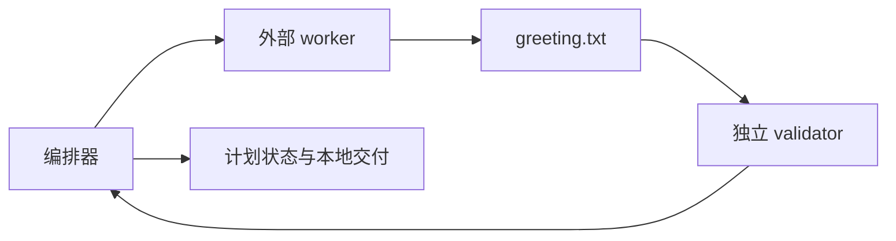

# 编排联动最小任务

<!-- large-task-planning:vision -->
## 愿景

由编排器委派外部 worker 创建确定性的文本产物，再由独立 validator 验证内容，形成可恢复的计划、提交和本地交付证据。

<!-- large-task-planning:global-design -->
## 全局设计

仓库已有 `check.sh` 作为唯一行为判据。worker 只创建根目录 `greeting.txt`，validator 只读代码并运行目标检查；编排器维护执行卡并完成提交与本地 remote 推送。

<!-- large-task-planning:manual-acceptance -->
## 人工验收

- 打开 `greeting.txt`，确认仅包含 `hello from orchestrated worker`。
- 执行 `./check.sh`，确认退出码为 0。

<!-- large-task-planning:success-criteria -->
## 成功标准

- `greeting.txt` 存在且内容逐字匹配计划。
- `./check.sh` 输出 `greeting check passed` 并以 0 退出。
- 独立 validator 返回继续结论，Story 状态为 done。

<!-- large-task-planning:story-map -->
## Story 地图

- [Story-01 创建并验证问候文件](stories/Story-01-创建并验证问候文件.md)：创建固定内容文件并完成独立验证。

<!-- large-task-planning:project-boundaries -->
## 项目边界

- 只允许修改 `greeting.txt` 与本计划的动态状态、仪表盘和证据。
- 不新增依赖，不访问业务网络，不修改 `check.sh`。
- worker 与 validator 不提交；编排器只推送到现有本地 `origin`。
