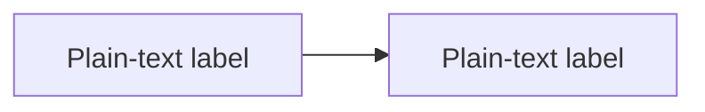

# Mermaid Lint

Author Mermaid safely, then verify that each target diagram renders.

Use the requested Markdown files, globs, or directories. For an implicit invocation while editing diagrams, use those changed files. Ask for scope only when neither the request nor current changes identify it.

## Secure-by-default authoring

When creating or materially editing a diagram, use the repository's centralized Mermaid security configuration if it enforces an equivalent or stronger policy. Otherwise begin each block with:



Apply this baseline:

- Keep diagrams non-interactive. Put links beside the diagram in Markdown instead of using `click` actions.
- Use quoted plain-text labels. Treat text from users, tools, logs, and external documents as untrusted; normalize it before placing it in Mermaid source.
- Keep `securityLevel` at `strict` or `sandbox` and `htmlLabels` at `false`.
- Reject `loose` / `antiscript`, `htmlLabels: true`, callback actions, `javascript:` URLs, and an empty `secure` allowlist.
- If the repository owns a runtime renderer, configure the same baseline centrally, sanitize the rendered SVG before DOM insertion, and block renderer network access. The repository configuration remains the source of truth; do not add per-diagram directives that the target renderer rejects.

For an existing diagram, preserve intent and appearance while bringing any unsafe configuration to the baseline. If the target platform cannot support the baseline, report the incompatibility instead of weakening security silently.

## Validate the target once

Inspect new/changed diagrams and any changed repository renderer configuration against the baseline above. Then resolve `python3`, falling back to `python`, and run:

```bash
python3 <skill-dir>/validate-mermaid.py "<markdown-file-or-glob>"
python3 <skill-dir>/validate-mermaid.py docs/
```

Choose the command matching the requested scope. One batch shares a browser session; it also checks dependencies, so a successful run does not need a second preflight or confirmation run.

The validator uses `mermaid.render` in a headless browser with strict security, HTML labels disabled, and external network requests blocked. Retain real rendering: `mermaid.parse` misses layout and runtime failures such as invalid gantt dates.

Exit codes: `0` all parsed target blocks render, `1` diagram errors, `2` usage or dependency failure. Read [output and troubleshooting](references/validation-output.md) when interpreting detailed errors, warnings, or timeouts.

## Fix and finish

- Locate errors with the reported source lines, preserve intended structure, and correct the demonstrated defect. Re-run affected files after a fix; reuse earlier passing evidence for unchanged files/configuration.
- Handle warnings too: an unterminated code fence is a document defect even if the process exits 0. An error-free result for parsed blocks does not prove skipped content is valid.
- A render timeout or crashed browser is not automatically a syntax defect. Investigate environment/size evidence before rewriting a diagram.
- Continue while fixes are supported and within scope. If repeated failure yields no new evidence, or intended meaning cannot be recovered, report that block and the specific missing information; independent blocks can still be fixed.

## Dependencies and permissions

When the result is `missing_dependency`, use its `missing` list and `install_hints`. Reuse any existing authorization for that exact setup; otherwise get authorization before installing packages or browsers. Local/npx execution still needs the applicable permission and is not equivalent to no installation.

A browser sandbox/profile/permission failure blocks rendering, not source editing. Retry with an available permitted configuration; changes to host security or global installation require the applicable authorization. Report the environment failure separately from Mermaid syntax.

## Report the evidence

Give the checked scope, passing/failing counts, fixes, and remaining warnings or blockers. The validator discards SVG output and does not inspect visual quality, overlap, diagram semantics, or agreement with prose. State only renderability and the security checks actually performed. Mention renderer-version differences when they affect the target platform.
