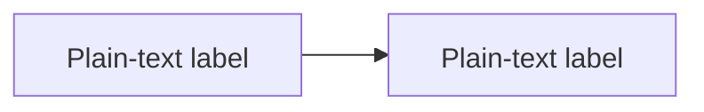

# Mermaid Lint

Author Mermaid safely, then validate every diagram with the real renderer. Locate and fix syntax, rendering, and unsafe-configuration defects.

**Input**: one or more markdown file paths, globs, or directories. If the user gives none, search the current directory for `.md` files and ask which ones to check.

## Secure-by-default authoring

When creating or materially editing a diagram, use the repository's centralized Mermaid security configuration if it enforces an equivalent or stronger policy. Otherwise begin each block with:



Apply this baseline:

- Keep diagrams non-interactive. Put links beside the diagram in Markdown instead of using `click` actions.
- Use quoted plain-text labels. Treat text from users, tools, logs, and external documents as untrusted; normalize it before placing it in Mermaid source.
- Keep `securityLevel` at `strict` or `sandbox` and `htmlLabels` at `false`.
- Reject `loose` / `antiscript`, `htmlLabels: true`, callback actions, `javascript:` URLs, and an empty `secure` allowlist.
- If the repository owns a runtime renderer, configure the same baseline centrally, sanitize the rendered SVG before DOM insertion, and block renderer network access. The repository configuration remains the source of truth; do not add per-diagram directives that the target renderer rejects.

For an existing diagram, preserve intent and appearance while bringing any unsafe configuration to the baseline. If the target platform cannot support the baseline, report the incompatibility instead of weakening security silently.

## How validation works

The script feeds each Mermaid block to the real renderer (`mermaid.render` inside a headless browser) configured with strict security, HTML labels disabled, and external network requests blocked. A block passes only if it renders.

Do not switch this to `mermaid.parse`. `parse` covers the parse phase only, so errors raised during rendering and layout escape it — an invalid gantt date such as `notadate` passes `parse` but fails to render. What the user actually wants to know is whether the diagram will display, and only the renderer answers that.

The whole batch shares one browser session, so checking 60 diagrams costs about as much as checking one. Scanning an entire directory in a single run is the intended usage, not a last resort.

Two things this skill deliberately does **not** do:

- It never inspects the rendered output. The SVG is discarded, nothing is written to disk, and no image is reviewed. The verdict is only whether rendering threw.
- It therefore says nothing about whether a diagram is *good*. Overlapping labels, tangled edges, a reversed arrow, or a diagram that contradicts the surrounding prose all render fine and all pass. This is a syntax and renderability linter, not a diagram design review. Do not claim otherwise when reporting results.

One caveat worth mentioning to the user when it matters: validation runs against the mermaid version bundled with the locally installed mermaid-cli, which may differ from the version GitHub or an IDE preview uses.

---

## Step 0: Check dependencies

Resolve the interpreter before the first run: prefer `python3`, then `python`. If neither exists, report
`missing_dependency` with an install hint instead of invoking a nonexistent command.

Run the validator once. If the JSON output has `status` set to `"missing_dependency"`, handle it via `install_hints`.

```bash
python {baseDirectory}/validate-mermaid.py "<markdown_file>"
```

**Do not install anything on your own initiative.** Show the user the `missing` list and `install_hints`, then ask how to proceed, offering these options:

- Run through `npx -p @mermaid-js/mermaid-cli mmdc` so nothing is installed globally
- Let the user install it and retry
- Cancel

Only run an install command after the user explicitly agrees. A global `npm install -g` affects every project on their machine, so it is their call to make.

If Chromium exists but launch fails with sandbox, profile, executable-permission, or browser-process
permission errors, classify it as an environment/browser permission failure rather than Mermaid syntax.
Retry only with an already available permitted browser configuration; do not install a browser, disable
host security, or rewrite diagrams. Report the failing launch detail and ask for permission when the
required browser execution is outside the current sandbox.

---

## Step 1: Review security

Before rendering, inspect every new or changed Mermaid block and any repository-owned Mermaid initializer. Apply the secure baseline above. A render pass does not prove safety: the renderer can successfully display an unsafe diagram.

## Step 2: Run validation

```bash
# Single file
python {baseDirectory}/validate-mermaid.py "docs/architecture.md"

# Several files, a glob, or a whole directory (directories match *.md recursively)
python {baseDirectory}/validate-mermaid.py "docs/**/*.md"
python {baseDirectory}/validate-mermaid.py docs/
```

The script writes JSON to stdout. Exit codes: `0` everything passed, `1` syntax errors present, `2` usage error or missing dependency.

### Output structure

```json
{
  "status": "error",
  "summary": {
    "files": 2,
    "total_blocks": 7,
    "valid_blocks": 6,
    "error_blocks": 1,
    "warnings": 1,
    "unmatched_patterns": []
  },
  "files": [
    {
      "file": "/abs/path/architecture.md",
      "total_blocks": 5,
      "valid_blocks": 4,
      "errors": [
        {
          "block_index": 2,
          "line_start": 45,
          "line_end": 58,
          "diagram_type": "graph TD",
          "mermaid_source": "graph TD\n    A[Start --> B[End]",
          "error_message": "Parse error on line 2: ...",
          "error_line_in_block": 2,
          "error_line_in_file": 46,
          "timed_out": false
        }
      ],
      "warnings": [
        { "line": 88, "message": "Mermaid code block opened at line 88 is never closed before end of file; skipped." }
      ],
      "blocks": [
        { "index": 1, "line_start": 20, "line_end": 35, "diagram_type": "graph TD", "valid": true }
      ]
    }
  ]
}
```

`error_line_in_file` is already an absolute line number in the source file. Use it directly instead of recomputing from `line_start`.

`warnings` do not change the exit code to 1, but still handle them and report them — an unterminated code block is a document defect in its own right.

`timed_out` set to `true` means rendering timed out or the render process crashed. That is not necessarily a syntax error and is usually an oversized diagram. Flag these for the user to confirm manually rather than trying to "fix" them.

---

## Step 3: Fix the errors

For each entry in each file's `errors` array:

1. **Read the source file** and locate the mermaid block between `line_start` and `line_end`.
2. **Analyse `error_message` and `mermaid_source`** to understand the root cause.
3. **Edit the offending mermaid block directly.** Change only what is broken; leave everything else alone.

### Common error patterns

| Error message contains | Usual cause | Fix direction |
|---|---|---|
| `Expecting 'SQE'` | unclosed `[` | add the missing `]` |
| `Expecting 'PE'` | unclosed `(` | add the missing `)` |
| `Expecting 'DIAMOND_STOP'` | unclosed `{` | add the missing `}` |
| `Unexpected token` | illegal character or reserved word | quote the text that needs escaping |
| `Lexer error` / `Lexical error` | illegal character | remove or escape it |
| `Parse error on line N` | syntax error on block-relative line N | use `error_line_in_file` to locate it in the source |
| `Invalid date:...` | gantt date does not match `dateFormat` | rewrite the date in the declared format |
| `Trying to inactivate an inactive participant` | unbalanced activate/deactivate in sequenceDiagram | add the missing `activate` or drop the extra `deactivate` |
| `Negative values are not allowed` | negative value in a pie chart | use non-negative values |
| `Edge limit exceeded` | diagram exceeds mermaid's edge cap | split it into several diagrams |

### Fixing principles

- **Secure output**: keep the secure baseline while fixing syntax; never make a diagram render by weakening security.
- **Minimal edits**: correct the syntax error only. Do not rewrite or reflow diagrams that already work.
- **Preserve intent**: the fixed diagram should keep the structure the original author meant to express.
- **Ask when unsure**: if the original intent is unrecoverable, such as a missing node label, ask the user instead of guessing.

---

## Step 4: Re-validate

After fixing, **always run the validator again**:

```bash
python {baseDirectory}/validate-mermaid.py "<same_targets>"
```

- All passing: report completion.
- Still failing: keep fixing and repeat this loop.
- Same block failed three times in a row: stop fixing it automatically, show the user its full source and error message, and ask for help.

---

## Reporting format

Show progress as you go:

```
## Mermaid Lint: docs/ (2 files)

Found 7 mermaid diagrams

  architecture.md
    Block 1 (lines 20-35): graph TD — passed
    Block 3 (lines 70-85): classDiagram — syntax error
      line 74: unclosed square bracket
    Warning line 88: mermaid code block never closed, skipped

  design.md
    Block 1 (lines 12-24): sequenceDiagram — passed

All 7 Mermaid diagrams use the secure baseline and render successfully. 1 warning needs manual confirmation.
```

---

## Environment variables

Not needed in normal use; these exist for troubleshooting.

- `MERMAID_LINT_BLOCK_TIMEOUT_MS`: render timeout for a single diagram. Default `20000`.
- `MERMAID_LINT_SESSION_OVERHEAD_MS`: budget for fixed per-session cost such as browser startup. Default `15000`. Raise it on machines with slow cold starts.

---

## Example invocations

```
User: /mermaid-lint docs/architecture.md
User: add a Mermaid architecture diagram to docs/architecture.md
User: check whether the mermaid diagrams in this markdown have syntax problems
User: review the Mermaid diagrams for unsafe configuration
User: validate the mermaid diagrams across everything under docs/
User: fix the mermaid errors in docs/design.md
```
