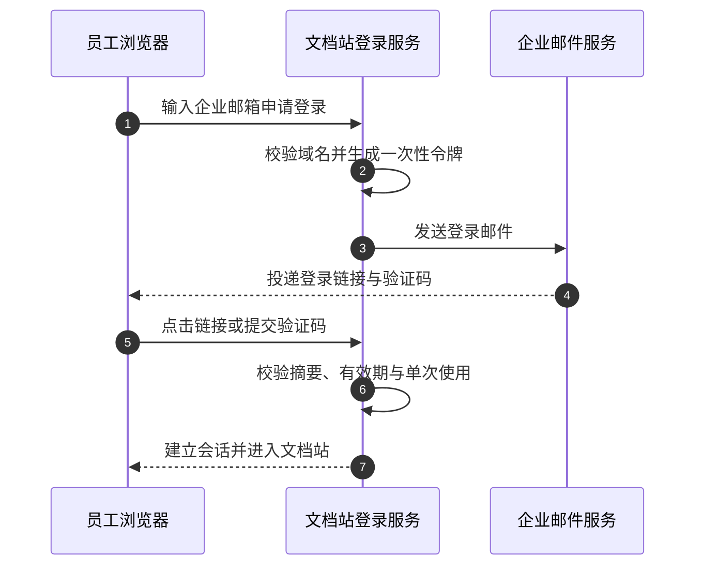
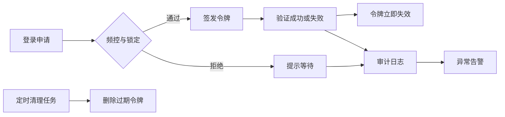

# 内部文档站一次性令牌登录

## 愿景

完成后，员工用企业邮箱收取一次性令牌即可登录文档站，不再共享一个密码。站点能识别每次登录的员工，能拦截滥用，并留下可查的审计记录。运维不需要维护新的账号系统。

## 全局设计

本 Epic 交付一个能力：一次性令牌登录。它部署在文档站后端内部，不新增独立服务；唯一新的外部依赖是对企业邮件服务的出站调用。会话沿用文档站现有机制，员工邮箱就是身份标识。

**能力一：员工完成一次登录。** 从申请到进入站点的完整路径如下。

**能力二：防护、清理与审计在后台持续运行。** 与登录请求不同，这条流按时间驱动。

各组件职责：登录页负责收集邮箱与验证码；登录服务负责签发、校验、频控和清理，令牌只存摘要；邮件服务只负责投递；审计日志记录四类事件并驱动告警。精确参数由 Agent 侧《一次性令牌契约》维护。

## 成功标准

- 任意员工可用企业邮箱完成登录，从申请到进入站点不超过 1 分钟，全程无需密码。
- 同一令牌第二次使用被拒绝；超过 15 分钟有效期的令牌被拒绝。
- 超出契约频控的申请被拒绝，并给出等待提示。
- 签发、成功、失败、锁定四类事件都有审计记录，保留 180 天。
- 预发环境全量验收通过；生产灰度一天后无回退需求。
- 回退演练证明共享密码入口可在一次发布内恢复。

## Story 地图

- [Story-01-令牌签发与投递](stories/Story-01-令牌签发与投递.md)：员工提交企业邮箱后，站点生成只存摘要的令牌，并投递含链接与验证码的邮件。
- [Story-02-令牌验证与会话](stories/Story-02-令牌验证与会话.md)：员工使用令牌完成登录，站点校验并建立现有会话。
- [Story-03-令牌防护与生命周期](stories/Story-03-令牌防护与生命周期.md)：单次使用、有效期、申请频控与定时清理落地。
- [Story-04-登录审计与告警](stories/Story-04-登录审计与告警.md)：登录链路的审计事件、查询与异常告警落地。
- [Story-05-全量验收与灰度上线](stories/Story-05-全量验收与灰度上线.md)：预发全量验收、生产灰度、共享密码入口下线与回退演练。

## 项目边界

- 不新建账号体系，不接入公司单点登录；企业邮箱即身份。
- 不改动文档内容与权限模型；登录后的权限维持现状。
- 仅企业域名邮箱可申请令牌；外部邮箱一律拒绝。
- 移动端专属适配不在本 Epic 内。
